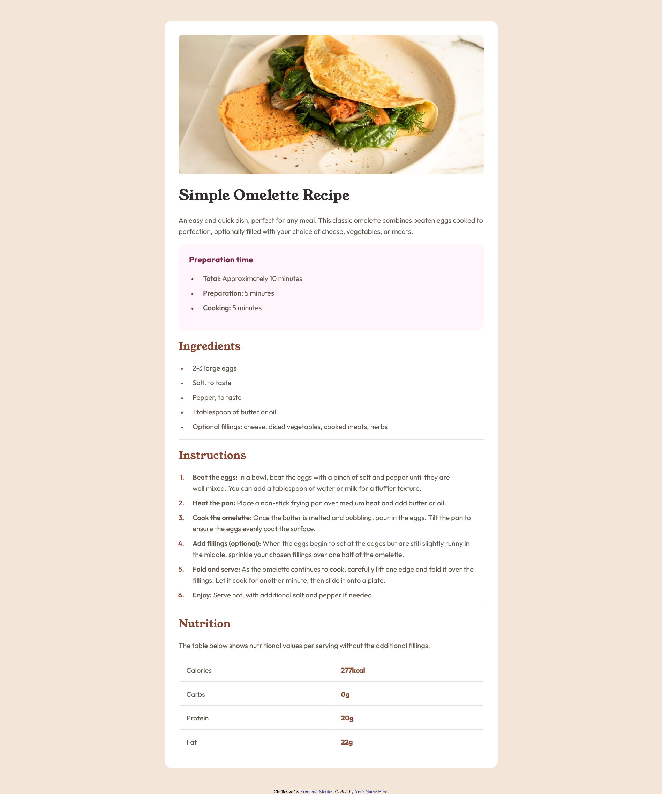

# Frontend Mentor - Recipe page solution

This is a solution to the [Recipe page challenge on Frontend Mentor](https://www.frontendmentor.io/challenges/recipe-page-KiTsR8QQKm). Frontend Mentor challenges help you improve your coding skills by building realistic projects.

## Table of contents

- [Overview](#overview)
  - [The challenge](#the-challenge)
  - [Screenshot](#screenshot)
  - [Links](#links)
- [My process](#my-process)
  - [What I learned](#what-i-learned)
- [Author](#author)
  s

## Overview

### Screenshot



### Links

- Solution URL: [Github](https://github.com/mythbus0/frontendmentor_recipe_page)
- Live Site URL: [Github Page](https://your-live-site-url.com)

## My process

### What I learned

I learned how to customize list item.

```css
li {
  /* list position outside
    Hello

  - list1
  - list2

  */
  list-style-position: inside; /*it will position inside the text box*/

  /* list position inside
    Hello

    - list1
    - list2

  */

  /* To add space between marker and list content */

  /*
    Hello

    -  <..1rem..>   list1
    -  <..1rem..>   list2

  */
  span {
    position: relative;
    left: 1rem;
  }
  &::marker {
    font-size: 0.75rem;
  }
}
```

## Author

- Website - [Github Page](https://mythbus0.github.io/)
- Frontend Mentor - [@mythbus0](https://www.frontendmentor.io/profile/mythbus0)
